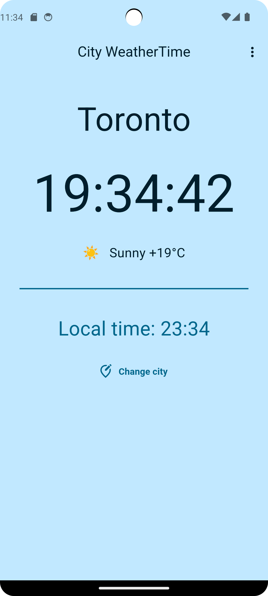
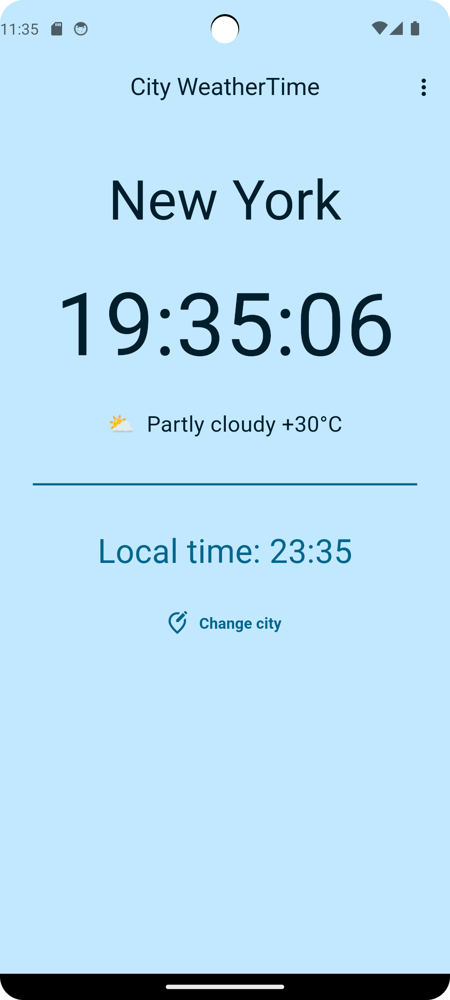
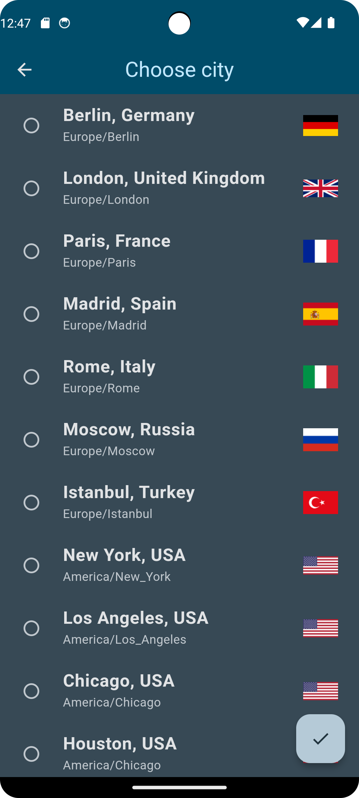
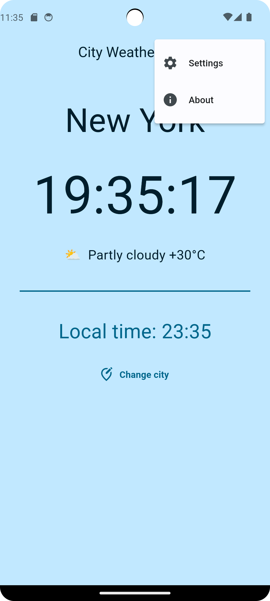
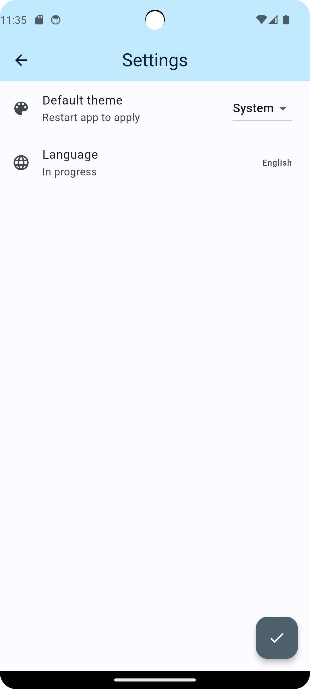
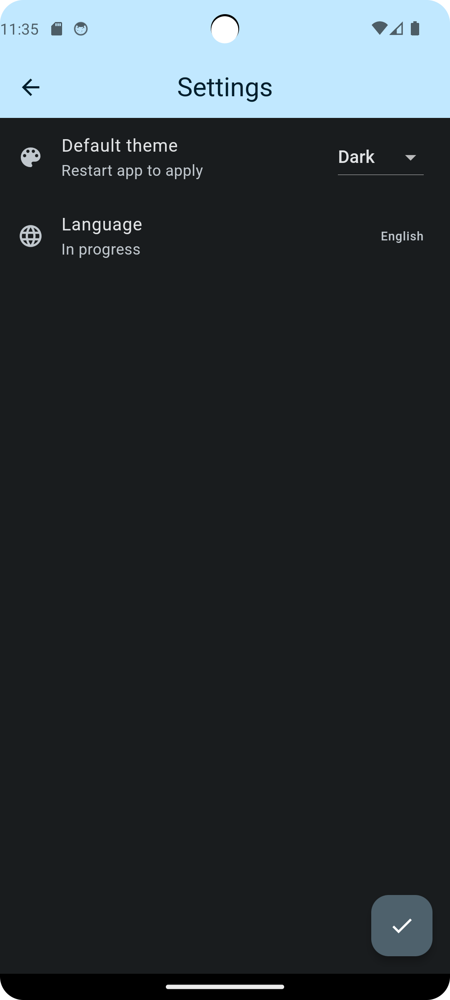
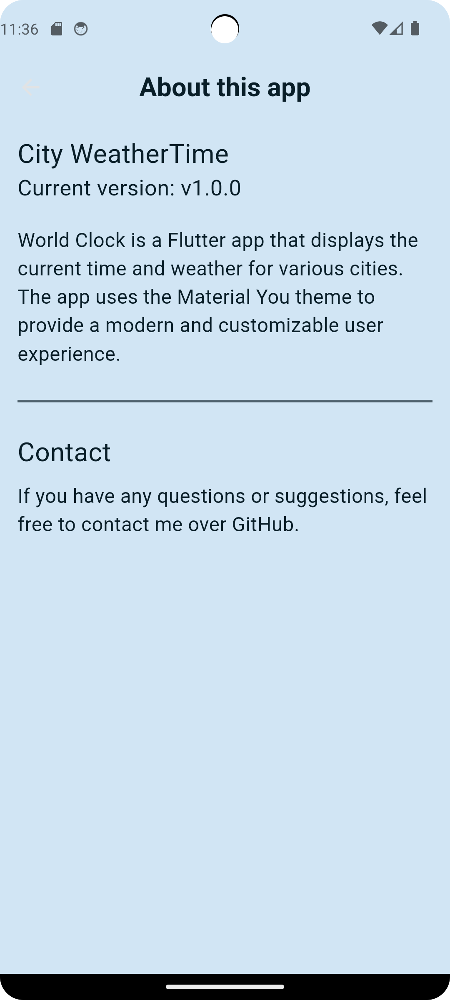

# CityWeatherTime

A new Flutter project.

## Function

For this app you can see time, weather and temperature.
There is a main page that when user open the app it will show CityWeatherTime in Toronto.
If you want to see other city, you can click "change city"

  
  
  
  

  
  
  

  

