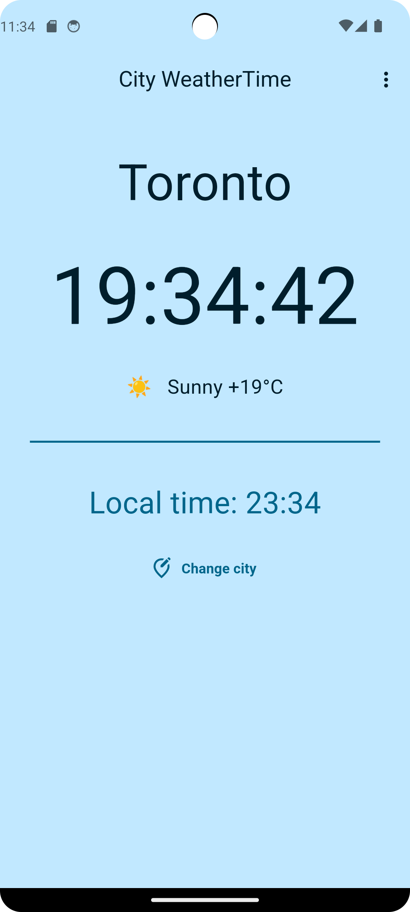

# world_clock_v2

A new Flutter project.

## Function

For this app you can see time, weather and temperature.
There is a main page that when user open the app it will show CityWeatherTime in Toronto.

